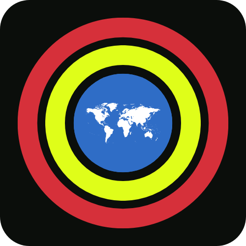

# BlackMap 🗺️

<div align="center">
  
</div>

A beautiful and modern Flutter travel destination discovery app that helps you explore popular destinations around the world. BlackMap features an elegant dark/light theme system, smooth animations, and an intuitive user interface for discovering amazing places to visit.

## ✨ Features

- 🎨 **Beautiful UI/UX** - Modern, clean design with smooth animations
- 🌙 **Dark/Light Theme** - Toggle between dark and light modes
- 🔍 **Smart Search** - Search and filter destinations by category
- 🏷️ **Category Filtering** - Filter by Ocean, Mountains, Hiking, Beach, Forest, Camping
- 📱 **Responsive Design** - Optimized for mobile devices
- ⚡ **Smooth Animations** - Powered by Flutter Animate
- 🎯 **Riverpod State Management** - Clean and efficient state management
- 💾 **Persistent Settings** - Theme preferences saved locally

## 🚀 Getting Started

### Prerequisites

- Flutter SDK (3.8.1 or higher)
- Dart SDK
- Android Studio / VS Code
- iOS Simulator / Android Emulator

### Installation

1. **Clone the repository**
   ```bash
   git clone https://github.com/yourusername/blackmap.git
   cd blackmap
   ```

2. **Install dependencies**
   ```bash
   flutter pub get
   ```

3. **Run the app**
   ```bash
   flutter run
   ```

## 📱 Screenshots

The app features:
- **Splash Screen** - Animated loading with progress indicators
- **Home Screen** - Destination cards with category filtering
- **Search & Filter** - Find destinations by name or category
- **Settings** - Theme customization options

## 🛠️ Tech Stack

- **Framework**: Flutter 3.8.1
- **State Management**: Riverpod
- **Animations**: Flutter Animate
- **Icons**: Flutter SVG
- **Fonts**: Google Fonts (Lexend, MarcellusSC)
- **Storage**: Shared Preferences
- **Architecture**: Clean Architecture with providers

## 📦 Dependencies

- `flutter_riverpod` - State management
- `flutter_animate` - Smooth animations
- `flutter_svg` - SVG icon support
- `google_fonts` - Custom typography
- `shared_preferences` - Local storage

## 🎨 Design System

- **Primary Color**: Blue (#2E6DC6)
- **Typography**: Lexend (various weights), MarcellusSC
- **Icons**: Custom SVG icons
- **Theme**: Material Design 3 with custom theming

## 📁 Project Structure

```
lib/
├── const/           # App constants and themes
├── data/            # Data models
├── providers/       # Riverpod providers
├── UI/              # User interface screens
│   ├── home/        # Home screen
│   ├── settings/    # Settings screen
│   └── splash_started/ # Splash and onboarding
└── widgets/         # Reusable UI components
```

## 🤝 Contributing

1. Fork the repository
2. Create your feature branch (`git checkout -b feature/AmazingFeature`)
3. Commit your changes (`git commit -m 'Add some AmazingFeature'`)
4. Push to the branch (`git push origin feature/AmazingFeature`)
5. Open a Pull Request

## 📄 License

This project is licensed under the MIT License - see the [LICENSE](LICENSE) file for details.

## 👨‍💻 Author

**MANI821**
- Email: mirzamani821@gmail.com
- GitHub: [@MANI821](https://github.com/MANI821)

## 🙏 Acknowledgments

- Flutter team for the amazing framework
- Riverpod for state management
- Flutter Animate for smooth animations
- Google Fonts for typography

---

<div align="center">
  Made with ❤️ using Flutter
</div>
